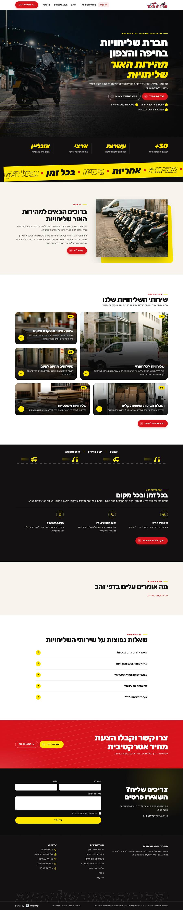
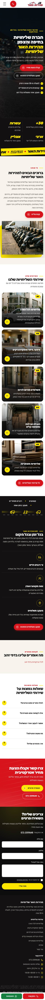
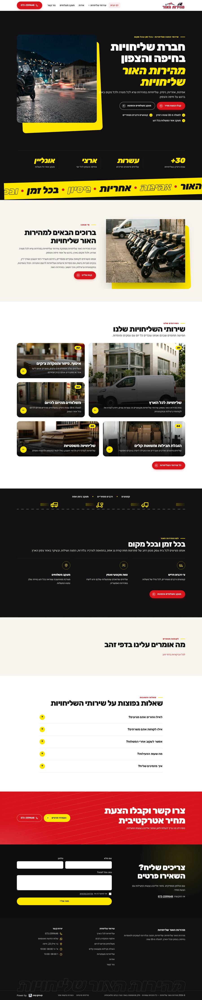
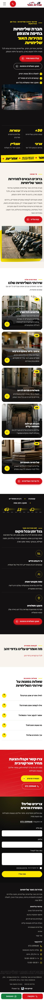
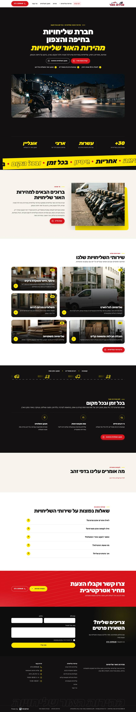
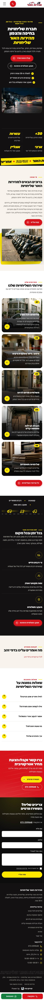

# כיווני עיצוב — מהירות האור שליחויות

אותו תוכן, אותו מבנה. משתנים רק צבעים, גופנים, פינות וסגנון ה-Hero. בוחרים אות אחת.

## A · לילה ומהירות: תמונה מלאה, צהוב על שחור

סגנון `clean` · Hero `image` · גופנים Rubik / Heebo

| מחשב | נייד |
|---|---|
|  |  |

## B · מסגרת צהובה: תמונה ממוסגרת על רקע כהה

סגנון `clean` · Hero `split` · גופנים Rubik / Heebo

| מחשב | נייד |
|---|---|
|  |  |

## C · הצהרה: כותרת ענקית במרכז ותמונה רחבה

סגנון `clean` · Hero `centered` · גופנים Rubik / Heebo

| מחשב | נייד |
|---|---|
|  |  |
